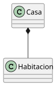
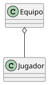
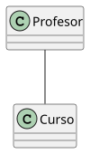
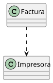

# Composición (`*--`)

## Qué es

Relación fuerte "todo–parte".

- La parte **NO puede existir sin el todo**.
- Si el todo se destruye, la parte también.
- Es la relación más fuerte.

## Ejemplo

- Una Casa y sus Habitaciones.
- Si la casa se destruye, las habitaciones dejan de existir.

## Representación

|
|:-:
|[Código fuente](./modelosUML/composicion.puml)

## Significado

Casa está compuesta por Habitaciones.
Las Habitaciones no existen independientemente.

---

# Agregación (`o--`)

## Qué es

Relación "todo–parte" débil.

- La parte **puede existir sin el todo**.
- No depende completamente del todo.

## Ejemplo

Un **Equipo** y sus **Jugadores**.

Si el equipo desaparece, los jugadores siguen existiendo.

## Representación

|
|:-:
|[Código fuente](./modelosUML/agregacion.puml)

## Significado

Un equipo tiene jugadores, pero los jugadores no dependen del equipo para existir.

---

# Asociación (`--`)

## Qué es

Relación simple entre clases.

- No implica dependencia fuerte.
- Solo indica que están relacionadas.

## Ejemplo

Un **Profesor** y un **Curso**.

Un profesor imparte un curso.

## Representación

|
|:-:
|[Código fuente](./modelosUML/asociacion.puml)

## Significado

Existe una relación entre Profesor y Curso.

---

# Uso / Dependencia (`..>`)

## Qué es

Relación más débil.

- Una clase **usa** a otra.
- No la contiene.
- No es relación estructural permanente.
- Normalmente ocurre en métodos.

## Ejemplo

Una **Factura** usa una **Impresora**.

La factura no tiene una impresora como parte interna, solo la usa para imprimir.

## Representación

|
|:-:
|[Código fuente](./modelosUML/uso.puml)

## Significado

Factura depende de Impresora para imprimir, pero no la posee.

---

# 📌 Comparación final

| Tipo        | Símbolo | Fuerza     | ¿La parte puede vivir sola? | Ejemplo           |
| ----------- | ------- | ---------- | --------------------------- | ----------------- |
| Composición | `*--`   | Muy fuerte | ❌ No                       | Casa–Habitación   |
| Agregación  | `o--`   | Media      | ✅ Sí                       | Equipo–Jugador    |
| Asociación  | `--`    | Normal     | ✅ Sí                       | Profesor–Curso    |
| Uso         | `..>`   | Débil      | ✅ Sí                       | Factura–Impresora |

---

# 🎯 Cómo recordarlo fácil

- `*--` 💀 muere con el todo
- `o--` 🤝 pertenece pero sobrevive
- `--` 🔗 están conectados
- `..>` ⚡ solo lo usa
